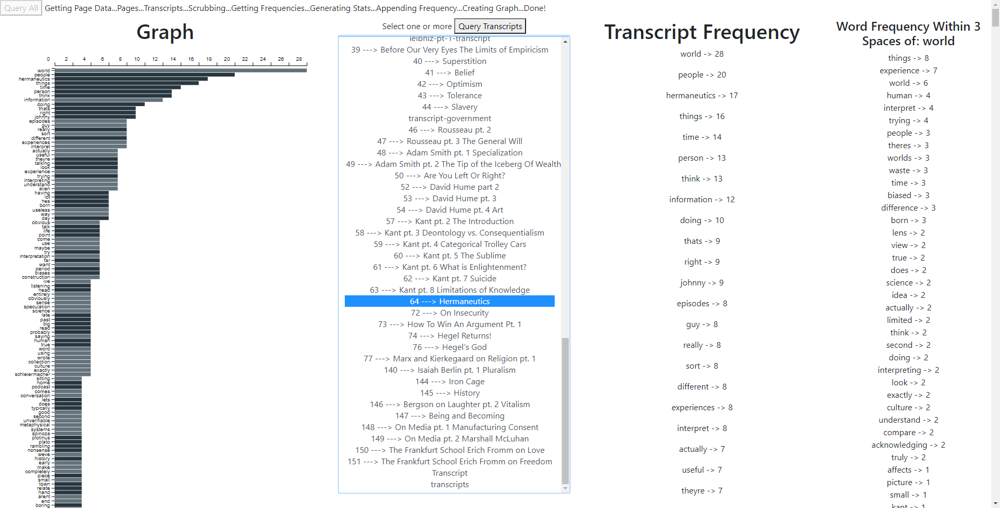
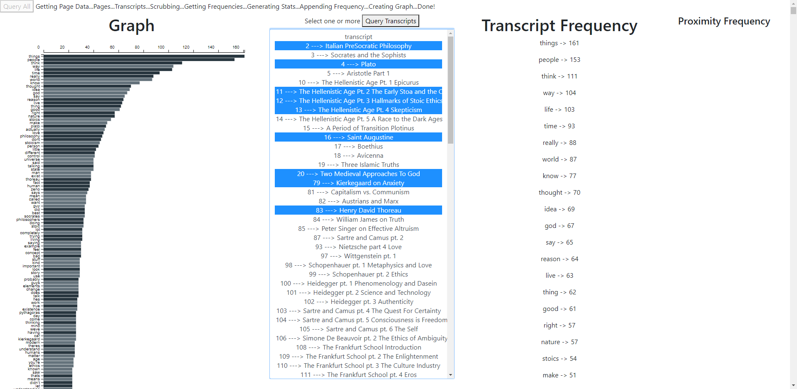

# Philosophize This! Webscraping

The Philosophize This! podcast(https://www.philosophizethis.org/) is an educational resource covering a wide range of topics including(but not limited to) History, Sociology, Spirituality and Philosophy. Noticing the language used in certain topics, or by certain individuals made me wonder what keywords are used to describe each topic.

How keywords come up to describe the Greek Hellenistic age? Can we use this to find a dialect for someone such as Epicurus?

What words describe Eastern vs. Western philosophy? German vs. American Philosophy? Sociology vs. Economic Theory?

To learn more, I took the opportunity to practice web scraping and data visualization.

This project visualizes the word frequencies from any combined(or single) number of podcast episodes. Clicking on any word reveals words used around it, giving a more qualitative
description of that word.

The algorithm is based around user interaction, running as follows:

1. Query All Button is Pressed
	* Filter for a list of URL links
	* Distinguish transcipt links from episode links
	* Pull the title from each link(if present) and associate with the transcript link
	* Append all episode titles to the page
2. Query Transcripts Button is Pressed
	* Query the list of transcript links selected
	* Pull all data from transcript pages, pull out main paragraphical content
	* Scrub text to remove all punctuation, spacing, stop words, and symbols
	* Generate word frequencies from a scrubbed list of paragraphs
	* Generate bar chart of frequencies and add mouseover functionality
	* Append chart, frequencies and stats to the page
3. Word is Clicked from Frequency List
	* Find all instances of given word in each transcript
	* Take and check bounds for all indices within 3(for 3 words out)
	* Find frequency of surrounding words and append to page

# Examples

## Hellenism Series
Taken from the series on Hellenism, we can see that objective concepts like "things", "people", or "life" are tackled.

Hellenism was defined by the struggle to find meaning and greater understanding from the power vacuum left after the death of Alexander the Great. There was an emphasis on the local accessibility of gods, and how they manifested in everyday situations. With the uncertainty of each day in an unstructured society, this sort of control and comfort certainly helped to alleviate the larger concerns of survival.

Looking at the words surrounding "things", we see this point emphasized in certain terms. "Things Happen", "Nature of Things", Control, Reason, Good and Bad catch the eye as objective language to describe the world. Was it the lack of structured society, rational understanding of the world, or thematic objectivism in Greek philosophy that generates this sort of language?


## Blank UI


## Transcript Selection


## Multiple Transcript Selection



# Stop Words

- "Stop Words" deemed irrelevant(the, and, or, I, etc.) that have been removed from the data for more menaingful results -

```javascript
// Words to disclude from word count - originally taken from microsoft PowerBI-Visuals-WordCloud
// Words continuously added to further specify analysis
const stopWords = [ 
    "a", "amazon", "about", "above", "above", "across", "ad", "after", "afterwards", "again", "against", "all", "almost", 
    "alone", "along", "already", "also","although","always","am","among", "amongst", "amoungst", "amount",  
    "an", "and", "another", "any","anyhow","anyone","anything","anyway", "anywhere", "are", "aren't", "around", "as",  
    "at", "back", "bc", "be","became", "because","become","becomes", "becoming", "been", "before", "beforehand", "behind", 
    "being", "below", "beside", "besides", "between", "beyond", "bill", "both", "bottom","but", "by", "call", 
    "can", "cannot", "cant", "co", "con", "could", "couldnt", "cry", "de", "describe", "detail", "do", "done", "don't", 
    "down", "due", "during", "each", "eg", "eight", "either", "eleven","else", "elsewhere", "empty", "enough", "episode", 
    "etc", "even", "ever", "every", "everyone", "everything", "everywhere", "except", "few", "fifteen", "fify", 
    "fill", "find", "fire", "first", "five", "for", "former", "formerly", "forty", "found", "four", "from", 
    "front", "full", "further", "get", "give", "go", "going", "had", "has", "hasnt", "have", "he", "hello", "hence", "her", 
    "here", "hereafter", "hereby", "herein", "hereupon", "hers", "herself", "him", "himself", "his", "how",
    "however", "hundred", "i", "ie", "if", "i'll", "im", "i'm" , "in", "inc", "indeed", "interest", "into", "is", "it", "its", "it’s", "itself", "just",
    "keep", "last", "latter", "latterly", "least", "less", "let's", "like", "ltd", "made", "many", "may", "me", "meanwhile", 
    "might", "mill", "mine", "more", "moreover", "most", "mostly", "move", "much", "must", "my", "myself", 
    "name", "namely", "neither", "never", "nevertheless", "next", "nine", "no", "nobody", "none", "noone", 
    "nor", "not", "nothing", "now", "nowhere", "of", "off", "often", "on", "once", "one", "only", "onto", "or", 
    "other", "others", "otherwise", "our", "ours", "ourselves", "out", "over", "own","part", "per", "perhaps", 
    "please", "put", "rather", "re", "same", "see", "seem", "seemed", "seeming", "seems", "serious", "several", 
    "she", "should", "show", "side", "since", "sincere", "six", "sixty", "so", "some", "somehow", "someone", 
    "something", "sometime", "sometimes", "somewhere", "still", "such", "take", "ten", "than", 
    "that", "the", "their", "them", "themselves", "then", "thence", "there", "thereafter", "thereby", "therefore", 
    "therein", "thereupon", "these", "they", "thick", "thin", "third", "this", "those", "though", "three", 
    "through", "throughout", "thru", "thus", "to", "together", "too", "top", "toward", "towards", "transcript", "twelve", 
    "twenty", "two", "un", "under", "until", "up", "upon", "us", "very", "via", "was", "we", "well", "were", 
    "what", "whatever", "when", "whence", "whenever", "where", "whereafter", "whereas", "whereby", "wherein",
    "whereupon", "wherever", "whether", "which", "while", "whither", "who", "whoever", "whole", "whom", "whose", 
    "why", "will", "with", "within", "without", "would", "year", "years", "yet", "you", "your", "youre", "you're", "yours", "yourself", "yourselves", "the", "stephen", "west",
    "sponsor"
    ];

```